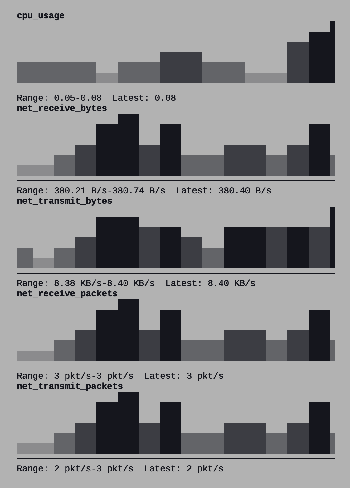

# Prometheus Dashboard

A retro-style TUI (Terminal User Interface) dashboard for Prometheus metrics visualization.



## Features

- Real-time metrics visualization from Prometheus
- Braille line graphs (2x4 dots per cell) with Y-axis labels
- History fetched via `query_range`, so graphs are filled immediately on startup
- Multiple series per query, drawn in different colors with a legend
- Dynamic vertical scaling for better visualization
- Configurable refresh intervals (default: 500ms)

## Prerequisites

- [Bun](https://bun.sh/) runtime
- Docker and Docker Compose (for running Prometheus and Node Exporter)

## Quick Start

### 1. Install dependencies

```bash
bun install
```

### 2. Start Prometheus and Node Exporter

```bash
cd example
docker compose up -d
cd ..
```

This will start:
- Prometheus server on `http://localhost:9090`
- Node Exporter on `http://localhost:9100`

### 3. Run the dashboard

```bash
bun start
```

or in development mode with hot reload:

```bash
bun run dev
```

## Configuration

Edit `prometheus-dash.yaml` to customize metrics and connection settings:

```yaml
prometheus:
  host: localhost
  port: 9090
  protocol: http

refresh_interval: 500  # milliseconds
range: 300  # seconds of history to display (default: 300)

metrics:
  - name: cpu_usage
    query: 'sum(rate(node_cpu_seconds_total{mode!="idle"}[10s]))'
  - name: net_receive_bytes
    query: 'rate(node_network_receive_bytes_total{device="eth0"}[10s])'
  - name: net_transmit_bytes
    query: 'rate(node_network_transmit_bytes_total{device="eth0"}[10s])'
  - name: net_receive_packets
    query: 'rate(node_network_receive_packets_total{device="eth0"}[10s])'
  - name: net_transmit_packets
    query: 'rate(node_network_transmit_packets_total{device="eth0"}[10s])'
```

## Usage

### Controls

- `q` or `ESC` or `Ctrl+C`: Exit the dashboard

## License

MIT License

## Author

jedipunkz

